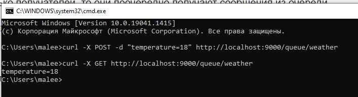
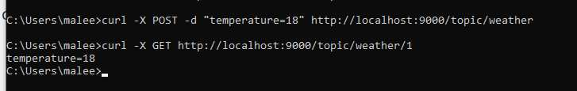

Pooh
====================================================
Project: Topic service Pooh.
----------------------------------------------------
The application launches Socket and waits for clients.
Clients can be of two types: senders (publisher), recipients (subscriber).
The project uses Sockets, IO streams, multithreading.

Configuration
----------------------------------------------------

Usage
----------------------------------------------------
- 1. Queue.
The sender sends a request to add data specifying the queue (weather) and the parameter 
value (temperature=18). The message is placed at the end of the queue. If there is no 
queue in the service, then you need to create a new one and put a message in it.
The recipient sends a request to receive data indicating the queue. The message is taken 
from the beginning of the queue and deleted.
If several recipients come to the queue, they take turns receiving messages from the queue.
For example:
curl -X POST -d "temperature=18" http://localhost:9000/queue/weather
curl -X GET http://localhost:9000/queue/weather
- 2.Topic.
The sender sends a request to add data indicating the topic (weather) and the parameter 
value (temperature=18). The message is placed at the end of each individual recipient queue. 
If the topic is not in the service, then the data is ignored.
The recipient sends a request for data with an indication of the topic. If there is no topic, 
then a new one is created. And if the topic is present, then the message is taken from the 
beginning of the recipient's individual queue and deleted.
For example:
curl -X POST -d "temperature=18" http://localhost:9000/topic/weather
curl -X GET http://localhost:9000/topic/weather/1
